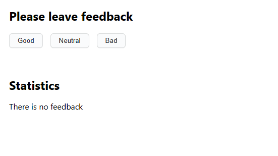
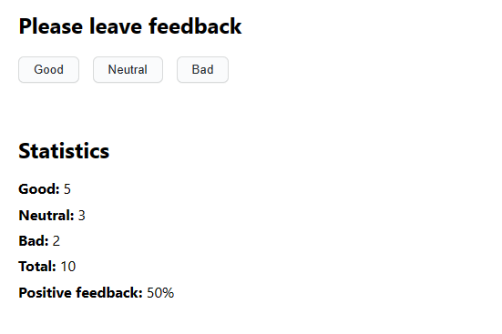

# SimpleFeedback app

This is a React app built using
[Create React App](https://github.com/facebook/create-react-app) as a part of
GoIT course. It allows you to collect and display feedback from users.

## Features

This app gives you three options as to what feedback you'd like to leave:

- Good
- Neutral
- Bad



Once at least one answer has been given, the following data will be displayed
below:

- Total amount of answers
- Percentage of "good" feedback compared to total



**PLEASE NOTE THAT AT THIS POINT YOU ARE NOT ABLE TO SAVE COLLECTED DATA BETWEEN
SESSIONS**

## Setup

1. Clone this repository.
2. Install the project's base dependencies using command

```shell
npm install
```

3. Start development mode by running command

```shell
npm start
```

4. You will now be able to access the app by going to
   [http://localhost:3000](http://localhost:3000) in your browser.
